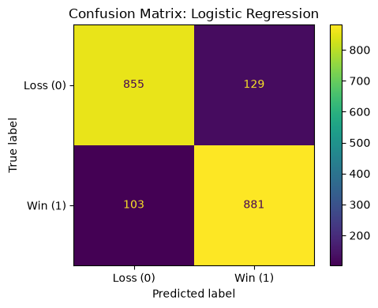

# NBA Win/Loss Classifier

Predicting whether an NBA team won or lost a game from its box-score statistics, using a scikit-learn pipeline with logistic regression, while deliberately avoiding target leakage.

## Overview

| | |
|---|---|
| **Dataset** | [`suzyanil/nba-data`](https://huggingface.co/datasets/suzyanil/nba-data): 9,840 team-games (2014–2018), 41 columns, perfectly balanced W/L |
| **Task** | Binary classification (`WINorLOSS`) |
| **Model** | Logistic Regression (`class_weight="balanced"`) inside a `Pipeline` + `ColumnTransformer` |
| **Tools** | pandas, scikit-learn, matplotlib |

## Approach

**Avoiding leakage.** The raw data contains post-game totals that directly reveal the result. Final scores *and* every scoring component (field goals, 3-pointers, free throws, for both teams) are dropped, since together they reconstruct the score. The model only sees:

- **Categorical:** `Team`, `Opponent`, `Home` → most-frequent imputation + one-hot encoding
- **Numerical (14):** rebounds, assists, steals, blocks, turnovers, fouls (team and opponent) → median imputation + standardization

An 80/20 stratified train/test split is used, with a fixed random seed for reproducibility.

## Results (held-out test set, n = 1,968)

| Metric | Score |
|---|---|
| Accuracy | **0.882** |
| Precision | 0.872 |
| Recall | 0.895 |
| F1 | 0.884 |

<p align="center">
  
</p>

Even without any scoring stats, the "hustle" stats (rebounding margin, assists, turnovers) predict the winner of nearly 9 in 10 games.

## Run it

```bash
pip install -r requirements.txt
jupyter notebook nba_win_loss_classifier.ipynb
```
